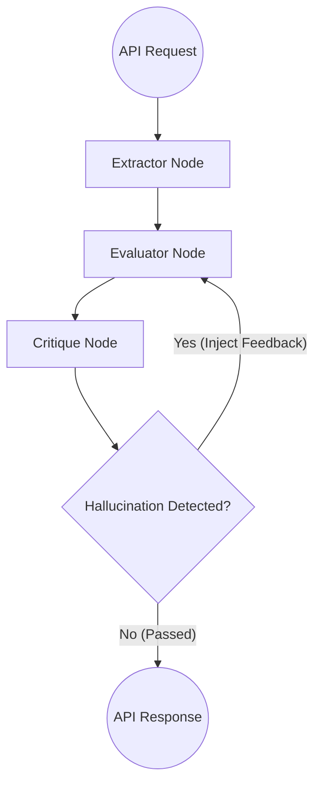

# Agentic ATS Matcher

An enterprise-grade, asynchronous AI evaluation engine designed to autonomously parse, evaluate, and critique candidate resumes against complex Job Descriptions. 

Built with **Python, FastAPI, and LangGraph**, this microservice utilizes a multi-step agentic state machine to process non-deterministic LLM outputs into strictly typed JSON contracts, preventing hallucinations and ensuring evaluation reliability.

## 🏗 System Architecture

The system utilizes a directed acyclic graph (DAG) to manage the evaluation lifecycle, incorporating a dedicated Human-in-the-Loop/Critique node to enforce output quality before API response.



### Core Tech Stack
* **API Layer:** FastAPI, Pydantic (Strict Schema Enforcement)
* **Orchestration:** LangGraph (State Machine, Multi-Agent Workflow)
* **Inference:** Ollama (Local execution of Qwen 2.5 32B for deterministic JSON parsing)
* **Infrastructure:** Docker, containerized for cloud-native deployment
* **Evaluations:** Promptfoo (Deterministic LLM assertion testing)

## 🚀 Architectural Decisions & Tradeoffs

1. **Deterministic API Contracts over Chat:** Raw LLMs are highly non-deterministic. To integrate AI into a production system, the API layer must be strictly typed. This project utilizes Pydantic models to define the exact required schema (e.g., `EvaluationResponse`), forcing the LLM to adhere to enterprise API standards rather than returning conversational markdown.
2. **The "Critique Node" Governance Loop:** Relying on a single LLM pass for decision-making introduces massive risk (hallucinations). I implemented a multi-agent loop where a secondary `Critique Agent` audits the `Evaluator Agent's` output against the ground-truth resume data. If a hallucinated skill is detected, the graph routes back to the Evaluator with specific correction feedback (capped at 3 retries to prevent runaway compute costs).
3. **Local Inference for Data Privacy:** Designed to process highly sensitive PII (Personally Identifiable Information). By utilizing a local inference server (Ollama/Qwen) rather than an external API, candidate data never leaves the host infrastructure, ensuring immediate compliance with GDPR and data residency constraints.

## 🧪 Eval-Driven Development (Test-Driven AI)

This project treats AI prompts as code. Before any prompt is integrated into the LangGraph state machine, its output is mathematically proven to adhere to strict JSON schemas to prevent pipeline parsing errors. 

**Evaluation Infrastructure:**
* `promptfooconfig.yaml`: The core evaluation suite defining the LLM provider and the Javascript validation assertions.
* `prompts/`: Directory containing isolated, version-controlled system prompts (e.g., `extractor.txt`).
* `data/`: Directory containing sanitized, mock unstructured resumes used as test payloads (e.g., `resume_sample.txt`).

**To run the LLM evaluations locally:**
Ensure `promptfoo` is installed globally (`npm install -g promptfoo`) and execute:
```bash
promptfoo eval
```

## 🛠 Local Setup & Installation

### Prerequisites
* Python 3.11+
* Docker
* [Ollama](https://ollama.com/) running locally with the `qwen2.5:32b` model.

### 1. Start the Local LLM
Ensure your local inference server is running:
```bash
ollama run qwen2.5:32b
```

### 2. Run via Docker

Because the FastAPI container needs to communicate with the Ollama instance running on your host machine, run the container using the host network.

#### Build the image
```bash
docker build -t agentic-ats .
```
#### Run the container (Linux)
```bash
docker run -d --network host --name ats-service agentic-ats
```
Note: For macOS/Windows, replace --network host with -p 8000:8000 and update main.py to point to http://host.docker.internal:11434.

###  3. Run Locally (Virtual Environment)

```bash
python3 -m venv venv
source venv/bin/activate
pip install -r requirements.txt
uvicorn main:app --reload
```

## 📡 API Documentation

Once running, navigate to http://127.0.0.1:8000/docs to view the auto-generated Swagger UI and test the endpoint.

```bash
POST /evaluate-candidate
```

Request Payload:

```bash
{
  "job_description": "Looking for a Python/FastAPI engineer with LangGraph experience.",
  "resume_text": "Larisa Pozhilova. Principal Architect. Built a local codebase retrieval state machine utilizing LangGraph, Python, and Qdrant."
}
```
Response Payload (Strictly Typed EvaluationResponse):

```bash
{
  "candidate_name": "Larisa Pozhilova",
  "overall_match_score": 90,
  "is_viable_candidate": true,
  "strengths": [
    {
      "category": "Core Architecture",
      "matched_skill": "LangGraph",
      "reasoning": "Candidate explicitly architects state machines using LangGraph."
    }
  ],
  "gaps": [],
  "agentic_summary": "Highly viable candidate with exact architectural matching for LangGraph and Python execution."
}
```
